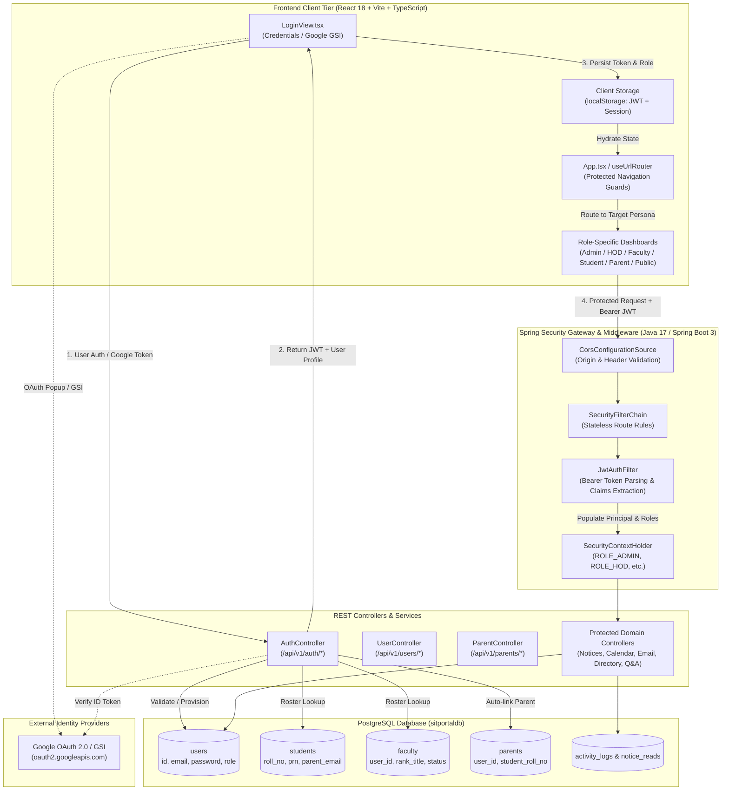
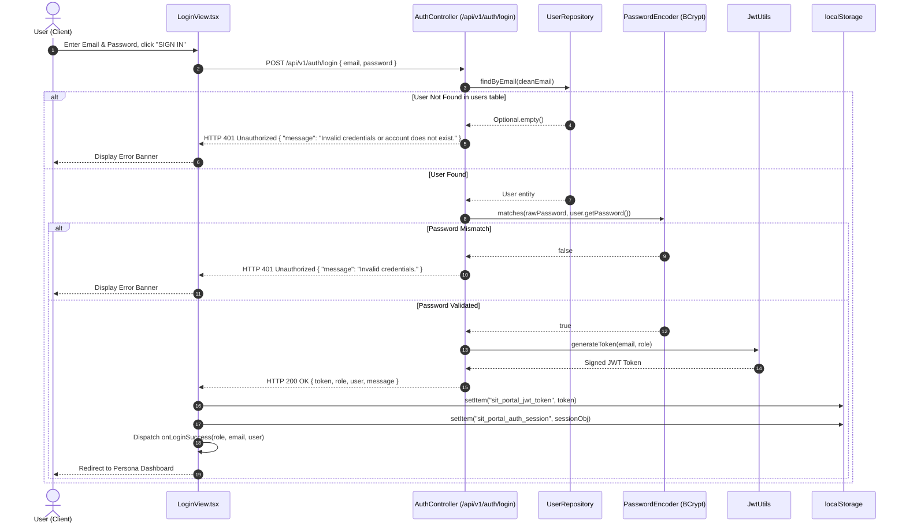
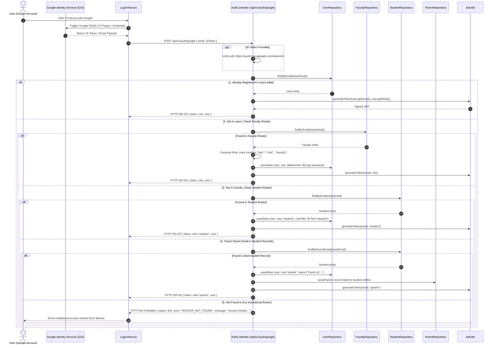
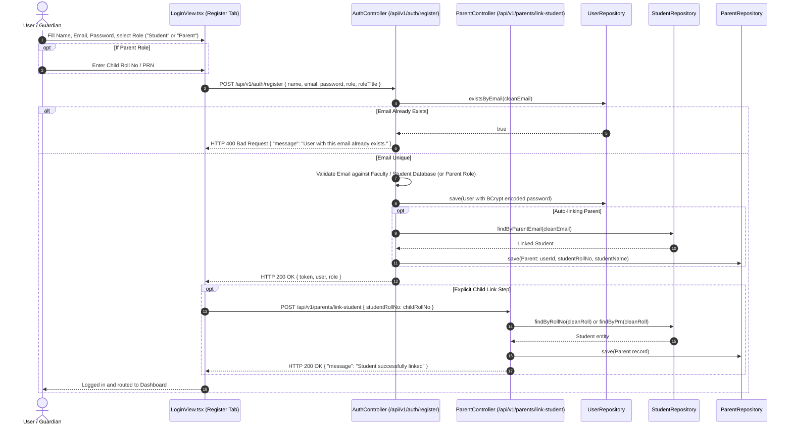
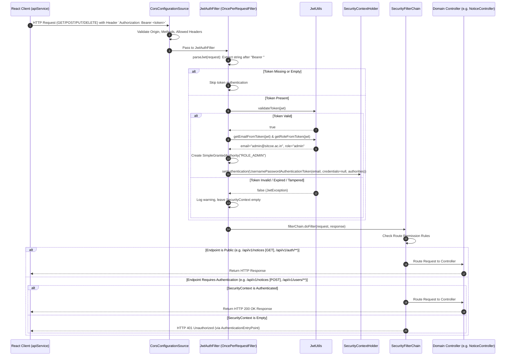
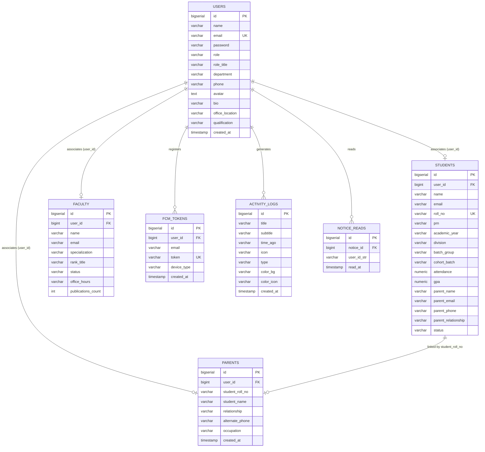

# High-Level Design (HLD) Specification: Authentication, Authorization & Role-Based Access Control (RBAC)

**Project:** Sharad Institute of Technology College of Engineering (SITCOE) — CSE Department Portal  
**Document Type:** High-Level Technical Architecture & System Design Document (HLD)  
**Scope:** End-to-End Authentication, Identity Verification, User Provisioning, JWT Token Lifecycle, Role-Based Access Control (RBAC), Multi-Persona Routing, Database Schemas, and Security Architecture  
**Target Systems:** Frontend (React 18 + TypeScript + Vite), Backend (Spring Boot 3.x + Java 17 + Spring Security 6), Database (PostgreSQL 15+ / `sitportaldb`), Google OAuth 2.0 Identity Provider  
**Status:** Approved for Production Architecture  

---

## Table of Contents

1. [Executive Summary & System Objectives](#1-executive-summary--system-objectives)
2. [End-to-End System Architecture](#2-end-to-end-system-architecture)
3. [User Personas & Role Hierarchy](#3-user-personas--role-hierarchy)
4. [Role-Based Access Control (RBAC) Matrix](#4-role-based-access-control-rbac-matrix)
5. [Authentication & Authorization Workflows](#5-authentication--authorization-workflows)
   - 5.1 [Institutional Credentials Login (Email + BCrypt)](#51-institutional-credentials-login-email--bcrypt)
   - 5.2 [Google OAuth 2.0 / SSO with Zero-Trust Institutional Roster Verification](#52-google-oauth-20--sso-with-zero-trust-institutional-roster-verification)
   - 5.3 [New User Registration & Parent-Student Association](#53-new-user-registration--parent-student-association)
   - 5.4 [Stateless Bearer JWT Interception & Spring Security Filter Chain](#54-stateless-bearer-jwt-interception--spring-security-filter-chain)
   - 5.5 [Session Recovery & Profile Hydration](#55-session-recovery--profile-hydration)
   - 5.6 [Profile Modification & Password Lifecycle](#56-profile-modification--password-lifecycle)
   - 5.7 [Logout & Client-Side Session Invalidation](#57-logout--client-side-session-invalidation)
6. [Cryptographic & Token Architecture](#6-cryptographic--token-architecture)
7. [Database Schemas & Entity-Relationship Data Models](#7-database-schemas--entity-relationship-data-models)
8. [Frontend State Architecture & Navigation Guards](#8-frontend-state-architecture--navigation-guards)
9. [REST API Specification (Auth, User & Parent Module)](#9-rest-api-specification-auth-user--parent-module)
10. [Security Failure Scenarios & Edge Cases](#10-security-failure-scenarios--edge-cases)
11. [Postman Integration & Verification Matrix](#11-postman-integration--verification-matrix)

---

## 1. Executive Summary & System Objectives

The **Sharad Institute of Technology College of Engineering (SITCOE) CSE Department Portal** is an institutional communication, academic milestone management, verified Q&A resolution, and administrative collaboration platform.

### Core Objectives of the Authentication & Role System
1. **Zero-Trust Identity Verification**: Prevent unauthorized signups or logins by strictly requiring any user (via credentials or Google OAuth) to pre-exist in the verified institutional database (Faculty Roster, Student Enrollment Roster, or Registered Parent-Student Record).
2. **Stateless Scalability**: Implement stateless JWT-based authentication adhering to RESTful standards, eliminating server-side session overhead.
3. **Granular Multi-Persona Authorization**: Segregate system features and views cleanly across six distinct user personas (`admin`, `hod`, `faculty`, `student`, `parent`, `public`).
4. **Automated Just-In-Time (JIT) Provisioning**: Automatically identify whether a logging-in user is an Administrator, HOD, Faculty, Student, or Parent from institutional roster metadata upon first Google OAuth sign-in.
5. **Data Integrity & Relational Safety**: Maintain relational integrity between system credentials (`users`), student academic profiles (`students`), faculty records (`faculty`), and parent associations (`parents`).

---

## 2. End-to-End System Architecture



---

## 3. User Personas & Role Hierarchy

The platform implements a non-overlapping, hierarchical role architecture:

```
                      ┌────────────────────────────────────────┐
                      │             [ Super Admin ]            │
                      │  Institute Controller & Platform Admin │
                      └──────────────────┬─────────────────────┘
                                         │
                      ┌──────────────────▼─────────────────────┐
                      │              [ HOD CSE ]               │
                      │  Head of Department / Academic Leader  │
                      └──────────────────┬─────────────────────┘
                                         │
                      ┌──────────────────▼─────────────────────┐
                      │           [ Faculty Member ]           │
                      │   Professors / Assistant Professors    │
                      └──────────────────┬─────────────────────┘
                                         │
        ┌────────────────────────────────┴────────────────────────────────┐
        │                                                                 │
┌───────▼────────────────────────┐                       ┌────────────────▼───────────────────────┐
│        [ Enrolled Student ]    │                       │           [ Parent / Guardian ]        │
│ B.Tech CSE (FE / SE / TE / BE) │                       │  Verified Parent Linked to Student PRN │
└────────────────────────────────┘                       └────────────────────────────────────────┘
        │                                                                 │
        └────────────────────────────────┬────────────────────────────────┘
                                         │
                      ┌──────────────────▼─────────────────────┐
                      │            [ Public Visitor ]          │
                      │   Unauthenticated Prospective & Guests │
                      └────────────────────────────────────────┘
```

### Detailed Persona Specifications

| Persona | Role Identifier (`role`) | Default Dashboard Route | Description & Primary Capabilities |
| :--- | :---: | :---: | :--- |
| **Super Admin** | `admin` | `dashboard` (`AdminDashboard`) | Institute controller with top-level system authority. Manages system settings, database synchronization, bulk student roster imports, global communication broadcasts, scraper control, and full CRUD access. |
| **Head of Department** | `hod` | `hod-dashboard` (`HodDashboard`) | Academic and departmental head of Computer Science & Engineering. Oversees faculty members, validates academic calendars, publishes department-wide circulars, reviews Q&A questions, and inspects analytics. |
| **Faculty Member** | `faculty` | `faculty-portal` (`FacultyDashboard`) | Professors, Associate Professors, and Assistant Professors. Publishes notices, manages coursework and laboratory resources, provides verified answers on the Q&A forum, logs attendance, and broadcasts class emails. |
| **Enrolled Student** | `student` | `student-dashboard` (`StudentDashboard`) | Enrolled B.Tech CSE students across 1st, 2nd, 3rd, and 4th years. Accesses class-specific and batch notices, academic milestones (5-day auto-retention), syllabus/documents, placement opportunities, and posts Q&A inquiries. |
| **Parent / Guardian** | `parent` | `parent-dashboard` (`ParentDashboard`) | Verified guardians linked via Roll No / PRN. Monitors child's academic progress, attendance percentage, fees/exam circulars, milestone schedules, and contacts faculty mentors. |
| **Public Visitor** | `public` | `public-landing` (`PublicLanding`) | Prospective students, alumni, and unauthenticated public guests. Explores department highlights, accreditations, placement records, faculty contact directory, and general public notices. |

---

## 4. Role-Based Access Control (RBAC) Matrix

The table below delineates granular authorization across every functional module in the SITCOE portal:

| Functional Module / View | Admin | HOD | Faculty | Student | Parent | Public |
| :--- | :---: | :---: | :---: | :---: | :---: | :---: |
| **Public Landing Page & General Info** | ✅ | ✅ | ✅ | ✅ | ✅ | ✅ |
| **Central Notice Board (Read Circulars)** | ✅ | ✅ | ✅ | ✅ | ✅ | ✅ (Public Only) |
| **Publish Department / College Notice** | ✅ | ✅ | ✅ | ❌ | ❌ | ❌ |
| **Edit / Delete Published Notice** | ✅ | ✅ | ✅ | ❌ | ❌ | ❌ |
| **Live College Web Scraper (`sitcoe.ac.in`)** | ✅ | ✅ | ❌ | ❌ | ❌ | ❌ |
| **Academic Calendar (Read Milestone Events)** | ✅ | ✅ | ✅ | ✅ (5-Day Rule) | ✅ (5-Day Rule) | ✅ (Active Only) |
| **Ingest Calendar Docs (`.docx` / PDF)** | ✅ | ✅ | ✅ | ❌ | ❌ | ❌ |
| **Create / Delete Calendar Milestones** | ✅ | ✅ | ✅ | ❌ | ❌ | ❌ |
| **Set Active Academic Semester** | ✅ | ✅ | ❌ | ❌ | ❌ | ❌ |
| **Student Roster Directory (Read)** | ✅ | ✅ | ✅ | ❌ | ❌ | ❌ |
| **Add / Edit / Delete Student Records** | ✅ | ✅ | ❌ | ❌ | ❌ | ❌ |
| **Bulk CSV Student Roster Upload** | ✅ | ✅ | ❌ | ❌ | ❌ | ❌ |
| **Faculty Directory & Status Toggle** | ✅ | ✅ | ✅ (Own Only) | ✅ (Read) | ✅ (Read) | ✅ (Read) |
| **Add / Edit / Delete Faculty Records** | ✅ | ✅ | ❌ | ❌ | ❌ | ❌ |
| **Targeted Bulk Email Broadcaster** | ✅ | ✅ | ✅ | ❌ | ❌ | ❌ |
| **Email Transmission Audit Logs** | ✅ | ✅ | ✅ | ❌ | ❌ | ❌ |
| **Submit Question in Q&A Forum** | ✅ | ✅ | ✅ | ✅ | ✅ | ❌ |
| **Post Official Verified Q&A Answer** | ✅ | ✅ | ✅ | ❌ | ❌ | ❌ |
| **Document & Syllabus Library (Download)** | ✅ | ✅ | ✅ | ✅ | ❌ | ❌ |
| **Upload Academic Documents / Syllabus** | ✅ | ✅ | ✅ | ❌ | ❌ | ❌ |
| **Curriculum & Lab Structure (Read)** | ✅ | ✅ | ✅ | ✅ | ❌ | ✅ |
| **Admin Command Center & Real-Time Metrics**| ✅ | ❌ | ❌ | ❌ | ❌ | ❌ |
| **Departmental Analytics Dashboard** | ✅ | ✅ | ❌ | ❌ | ❌ | ❌ |
| **System Settings (Scraper, Retention, Alerts)**| ✅ | ❌ | ❌ | ❌ | ❌ | ❌ |
| **Live Activity Ledger & Audit Stream** | ✅ | ✅ | ❌ | ❌ | ❌ | ❌ |
| **Parent-Student Record Association** | ✅ | ✅ | ❌ | ❌ | ✅ (Self-Link) | ❌ |
| **Placement Drives & Achievers Management**| ✅ | ✅ | ✅ | ✅ (Read) | ✅ (Read) | ✅ (Read) |

---

## 5. Authentication & Authorization Workflows

### 5.1 Institutional Credentials Login (Email + BCrypt)



---

### 5.2 Google OAuth 2.0 / SSO with Zero-Trust Institutional Roster Verification

The system enforces a **Zero-Trust Institutional Roster Policy**: Arbitrary Gmail addresses cannot access the portal. Upon receiving a Google OAuth payload, the system dynamically validates against the institutional database and auto-provisions the user's role:



---

### 5.3 New User Registration & Parent-Student Association



---

### 5.4 Stateless Bearer JWT Interception & Spring Security Filter Chain



---

### 5.5 Session Recovery & Profile Hydration

When a user refreshes the browser or opens the portal:
1. `App.tsx` reads `sit_portal_auth_session` from `localStorage`.
2. If present, initializes `isLoggedIn = true`, `userRole = role`, and `currentProfile = profile`.
3. Background API calls to `/api/v1/auth/me` or `/api/v1/users/profile` validate the token's active status against the server.
4. If token is invalid or expired (HTTP 401), `App.tsx` invokes `handleLogout()` to clear stale session keys.

---

### 5.6 Profile Modification & Password Lifecycle

Users can edit their personal details (`name`, `phone`, `avatar`, `bio`, `officeLocation`, `qualification`) and change their password:
- **Profile Update Endpoint**: `PUT /api/v1/users/profile`
  - Validates authentication via `SecurityContextHolder.getContext().getAuthentication()`.
  - Updates only permitted fields in the database.
  - Sanitizes the returned user object (password hash is set to `null`).
- **Password Change Endpoint**: `PUT /api/v1/users/change-password`
  - Validates current password against stored BCrypt hash via `passwordEncoder.matches()`.
  - Validates new password minimum length criteria (min 4 characters).
  - Encodes new password with `passwordEncoder.encode()` and commits transaction.

---

### 5.7 Logout & Client-Side Session Invalidation

Because JWTs are stateless, the client executes explicit revocation:
1. Removes `sit_portal_jwt_token` from `localStorage`.
2. Removes `sit_portal_auth_session` from `localStorage`.
3. Resets React top-level state: `isLoggedIn = false`, `userRole = 'public'`, `currentProfile = null`, `viewHistory = []`.
4. Dispatches user route to `public-landing`.

---

## 6. Cryptographic & Token Architecture

### 6.1 JSON Web Token (JWT) Structure

The SITCOE portal employs standard RFC 7519 compact JWT tokens:

```
[ Base64URL(Header) ] . [ Base64URL(Payload) ] . [ Base64URL(HMAC-SHA256 Signature) ]
```

#### JWT Header
```json
{
  "alg": "HS256",
  "typ": "JWT"
}
```

#### JWT Payload (Claims)
```json
{
  "sub": "poornima@sitcoe.org.in",
  "role": "hod",
  "iat": 1771845000,
  "exp": 1771931400
}
```

| Claim | Key | Purpose |
| :--- | :---: | :--- |
| **Subject** | `sub` | The primary identifier of the authenticated user (lowercase institutional email). |
| **Role Claim** | `role` | User role identifier (`admin`, `hod`, `faculty`, `student`, `parent`). Used to build Spring Security Granted Authorities (`ROLE_ADMIN`, `ROLE_HOD`, etc.). |
| **Issued At** | `iat` | Unix timestamp marking token generation. |
| **Expiration Time** | `exp` | Unix timestamp after which token is rejected (default duration: 24 Hours / `86,400,000 ms`). |

#### JWT Signature
```
HMACSHA256(
  base64UrlEncode(header) + "." + base64UrlEncode(payload),
  secret_key
)
```

### 6.2 Password Hashing Specification (BCrypt)
- **Algorithm**: BCrypt adaptive password-hashing algorithm (`BCryptPasswordEncoder`).
- **Work Factor / Cost**: 10 rounds (default).
- **Salt Generation**: Cryptographically secure 128-bit random salt automatically appended to the hash.
- **Output Format**: Standard `$2a$10$...` 60-character string stored in `users.password`.

---

## 7. Database Schemas & Entity-Relationship Data Models

### 7.1 Entity-Relationship Diagram (Auth & RBAC Domain)



### 7.2 Table Schemas & Data Constraints

#### `users` Table (Core Authentication Identity)
```sql
CREATE TABLE IF NOT EXISTS users (
    id BIGSERIAL PRIMARY KEY,
    name VARCHAR(100) NOT NULL,
    email VARCHAR(120) UNIQUE NOT NULL,
    password VARCHAR(255) NOT NULL,
    role VARCHAR(30) NOT NULL,            -- 'admin', 'hod', 'faculty', 'student', 'parent'
    role_title VARCHAR(100),
    department VARCHAR(50) DEFAULT 'Computer Science & Engineering',
    phone VARCHAR(30),
    avatar TEXT,
    bio VARCHAR(1000),
    office_location VARCHAR(100),
    qualification VARCHAR(100),
    created_at TIMESTAMP DEFAULT CURRENT_TIMESTAMP
);
CREATE INDEX idx_users_email ON users(email);
CREATE INDEX idx_users_role ON users(role);
```

#### `students` Table (Enrolled Academic Roster)
```sql
CREATE TABLE IF NOT EXISTS students (
    id BIGSERIAL PRIMARY KEY,
    user_id BIGINT REFERENCES users(id) ON DELETE CASCADE,
    name VARCHAR(150),
    email VARCHAR(150),
    roll_no VARCHAR(30) UNIQUE NOT NULL,
    prn VARCHAR(50),
    academic_year VARCHAR(10) NOT NULL,    -- 'FE', 'SE', 'TE', 'BE'
    division VARCHAR(10) NOT NULL,         -- 'A', 'B', 'C'
    batch_group VARCHAR(10) NOT NULL,      -- 'A1', 'A2', 'A3', etc.
    cohort_batch VARCHAR(20) NOT NULL,     -- '2023-2027'
    attendance NUMERIC(5, 2) DEFAULT 90.00,
    gpa NUMERIC(3, 2) DEFAULT 3.50,
    parent_name VARCHAR(150),
    parent_email VARCHAR(150),
    parent_phone VARCHAR(30),
    parent_relationship VARCHAR(50) DEFAULT 'Parent/Guardian',
    status VARCHAR(20) DEFAULT 'Active'
);
CREATE INDEX idx_students_email ON students(email);
CREATE INDEX idx_students_roll ON students(roll_no);
CREATE INDEX idx_students_prn ON students(prn);
```

#### `faculty` Table (Department Faculty Roster)
```sql
CREATE TABLE IF NOT EXISTS faculty (
    id BIGSERIAL PRIMARY KEY,
    user_id BIGINT REFERENCES users(id) ON DELETE CASCADE,
    name VARCHAR(150),
    email VARCHAR(150),
    specialization VARCHAR(150) NOT NULL,
    rank_title VARCHAR(100) NOT NULL,      -- 'Head of Department', 'Associate Professor', etc.
    status VARCHAR(30) DEFAULT 'ON CAMPUS',-- 'ON CAMPUS', 'IN MEETING', 'IN LAB', 'OFF CAMPUS'
    office_hours VARCHAR(100),
    publications_count INT DEFAULT 0
);
CREATE INDEX idx_faculty_email ON faculty(email);
```

#### `parents` Table (Guardian Child Association)
```sql
CREATE TABLE IF NOT EXISTS parents (
    id BIGSERIAL PRIMARY KEY,
    user_id BIGINT REFERENCES users(id) ON DELETE CASCADE,
    student_roll_no VARCHAR(30) NOT NULL,
    student_name VARCHAR(100),
    relationship VARCHAR(50) DEFAULT 'Parent/Guardian',
    alternate_phone VARCHAR(20),
    occupation VARCHAR(100),
    created_at TIMESTAMP DEFAULT CURRENT_TIMESTAMP
);
CREATE INDEX idx_parents_user_id ON parents(user_id);
CREATE INDEX idx_parents_student_roll ON parents(student_roll_no);
```

---

## 8. Frontend State Architecture & Navigation Guards

### 8.1 State Management Hierarchy (`src/App.tsx`)

```
App.tsx (Root State Orchestrator)
 │
 ├── State: isLoggedIn (boolean)  <-- Hydrated from localStorage 'sit_portal_auth_session'
 ├── State: userRole (UserRole)    <-- 'admin' | 'hod' | 'faculty' | 'student' | 'parent' | 'public'
 ├── State: currentProfile (UserProfile | null)
 ├── State: activeView (ViewMode)  <-- Synchronized with URL hash & browser history
 └── State: intendedView (ViewMode | null) <-- Restores target route post-login (BUG-001 Fix)
```

### 8.2 Client Route Guard Logic (`handleProtectedNavigate`)

The following matrix governs client-side navigation restrictions:

```typescript
const handleProtectedNavigate = (view: ViewMode, emailContext?: string) => {
  const publicViews: ViewMode[] = [
    'public-landing', 'login', 'notices', 'faculty', 
    'students', 'questions', 'academic-calendar'
  ];
  const adminViews: ViewMode[] = ['bulk-email', 'faculty-email'];

  // 1. Unauthenticated Guard
  if (!isLoggedIn && !publicViews.includes(view)) {
    alert('Authentication Required: Please sign in to access this portal section.');
    setIntendedView(view);
    setActiveView('login');
    return;
  }

  // 2. Super Admin Only Guard
  if (view === 'settings' && userRole !== 'admin') {
    alert('Access Restricted: System settings require Administrator credentials.');
    return;
  }

  // 3. Admin & HOD Only Guard
  if (view === 'analytics' && !['admin', 'hod'].includes(userRole)) {
    alert('Access Restricted: System analytics require Administrator or HOD credentials.');
    return;
  }

  // 4. Staff Email Broadcast Guard
  if (adminViews.includes(view) && !['admin', 'hod', 'faculty'].includes(userRole)) {
    alert('Access Restricted: Broadcast panels require Administrator, HOD, or Faculty credentials.');
    return;
  }

  // 5. Parent Document Boundary
  if (userRole === 'parent' && (view === 'documents' || view === 'curriculum')) {
    alert('Access Restricted: Document repository is reserved for students and faculty.');
    return;
  }

  // Route Granted
  setActiveView(view);
};
```

### 8.3 Post-Login Persona View Dispatcher

Upon successful authentication, the user is dispatched to their designated command center:

```typescript
const targetDashboard = 
    role === 'admin'   ? 'dashboard'        : // AdminDashboard.tsx
    role === 'hod'     ? 'hod-dashboard'    : // HodDashboard.tsx
    role === 'faculty' ? 'faculty-portal'   : // FacultyDashboard.tsx
    role === 'parent'  ? 'parent-dashboard' : // ParentDashboard.tsx
                         'student-dashboard'; // StudentDashboard.tsx
```

---

## 9. REST API Specification (Auth, User & Parent Module)

### 9.1 Authentication Controller (`/api/v1/auth`)

#### `POST /api/v1/auth/login`
- **Description**: Authenticates user using email and password.
- **Access**: Public
- **Request Body**:
  ```json
  {
    "email": "admin@sitcoe.ac.in",
    "password": "Admin@SIT2026!"
  }
  ```
- **Response `200 OK`**:
  ```json
  {
    "token": "eyJhbGciOiJIUzI1NiIsInR5cCI6IkpXVCJ9...",
    "role": "admin",
    "message": "Authentication successful.",
    "user": {
      "id": 1,
      "name": "Institute Administrator",
      "email": "admin@sitcoe.ac.in",
      "role": "admin",
      "roleTitle": "Institute Administrator & Portal Controller",
      "department": "Sharad Institute of Technology"
    }
  }
  ```
- **Response `401 Unauthorized`**:
  ```json
  {
    "message": "Invalid credentials."
  }
  ```

---

#### `POST /api/v1/auth/google`
- **Description**: Verifies Google Identity Services (GSI) credential or email against the institutional roster. Auto-provisions new users if found in Faculty or Student databases.
- **Access**: Public
- **Request Body**:
  ```json
  {
    "email": "student@sitcoe.org.in",
    "idToken": "eyJhbGciOiJSUzI1NiIs..."
  }
  ```
- **Response `200 OK`**:
  ```json
  {
    "token": "eyJhbGciOiJIUzI1NiIsInR5cCI6IkpXVCJ9...",
    "role": "student",
    "message": "Google Authentication successful.",
    "user": {
      "id": 42,
      "name": "Rohan Deshmukh",
      "email": "student@sitcoe.org.in",
      "role": "student",
      "roleTitle": "B.Tech Student",
      "department": "Computer Science & Engineering"
    }
  }
  ```
- **Response `403 Forbidden` (Roster Rejection)**:
  ```json
  {
    "status": "403",
    "error": "ROSTER_NOT_FOUND",
    "message": "Access Denied: The Google account (unauthorized@gmail.com) is not registered in the official Sharad Institute of Technology (SITCOE) & Trust institutions roster."
  }
  ```

---

#### `POST /api/v1/auth/register`
- **Description**: Registers a student or parent account with roster verification.
- **Access**: Public
- **Request Body**:
  ```json
  {
    "name": "Shubham Kulkarni",
    "email": "shubham.k@sitcoe.org.in",
    "password": "Password@123",
    "role": "student",
    "roleTitle": "B.Tech Student"
  }
  ```
- **Response `200 OK`**: Returns JWT token and sanitized user object.

---

#### `GET /api/v1/auth/me`
- **Description**: Validates Bearer token and returns active user profile.
- **Access**: Authenticated (`Bearer <token>`)
- **Response `200 OK`**:
  ```json
  {
    "email": "admin@sitcoe.ac.in",
    "role": "admin",
    "user": {
      "id": 1,
      "name": "Institute Administrator",
      "email": "admin@sitcoe.ac.in",
      "role": "admin",
      "roleTitle": "Institute Administrator & Portal Controller"
    }
  }
  ```

---

### 9.2 User Management Controller (`/api/v1/users`)

| Method | Path | Access | Description |
| :--- | :--- | :---: | :--- |
| `GET` | `/api/v1/users` | `Authenticated` | Lists all users with hidden passwords. |
| `GET` | `/api/v1/users/profile` | `Authenticated` | Fetches active user's complete profile. |
| `PUT` | `/api/v1/users/profile` | `Authenticated` | Updates profile (`name`, `avatar`, `bio`, `phone`, `officeLocation`, `qualification`). |
| `PUT` | `/api/v1/users/change-password`| `Authenticated` | Validates current password and updates to new BCrypt hash. |

---

### 9.3 Parent Association Controller (`/api/v1/parents`)

| Method | Path | Access | Description |
| :--- | :--- | :---: | :--- |
| `GET` | `/api/v1/parents/me` | `Authenticated (Parent)` | Retrieves parent profile and linked student academic record. |
| `POST` | `/api/v1/parents/link-student` | `Authenticated (Parent/Admin)`| Links parent account to student via Roll No / PRN. |
| `GET` | `/api/v1/parents/notices` | `Authenticated (Parent)` | Fetches prioritized circulars relevant to parents. |

---

## 10. Security Failure Scenarios & Edge Cases

| Scenario / Edge Case | Triggering Condition | System Behavior & Mitigation | HTTP Status |
| :--- | :--- | :--- | :---: |
| **Unregistered Google Account** | Google sign-in with email not present in `users`, `faculty`, or `students`. | Rejects login immediately. Returns descriptive institutional error message; does not create empty records. | `403 Forbidden` |
| **Invalid Password Attempt** | Wrong password provided in `/auth/login`. | Validated via `passwordEncoder.matches()`; fails safely with generic error. | `401 Unauthorized` |
| **Expired JWT Token** | Request made after 24h expiration window. | `JwtUtils.validateToken()` throws `ExpiredJwtException`; `JwtAuthFilter` leaves context empty; Spring Security denies access. | `401 Unauthorized` |
| **Tampered / Corrupt JWT** | Altered token payload or incorrect HMAC signature. | `JwtUtils.validateToken()` fails cryptographic signature verification; request rejected. | `401 Unauthorized` |
| **Duplicate Registration** | Registering an email that already exists in `users` table. | `userRepository.existsByEmail()` check catches duplication; rejects gracefully. | `400 Bad Request` |
| **Unauthorized View Access** | Student or Parent manually attempting to hit `/api/v1/settings` or `/api/v1/email/send`. | Spring Security role authorization check denies request. | `403 Forbidden` |
| **Parent Re-Association Conflict** | Parent account attempting to overwrite an already linked verified child without approval. | `ParentController` checks existing `studentRollNo`; rejects overwrite and advises contacting department office. | `403 Forbidden` |
| **CORS Policy Violation** | Request from unauthorized third-party origin. | Intercepted and rejected by `CorsConfigurationSource` before reaching controllers. | `403 Forbidden` |

---

## 11. Postman Integration & Verification Matrix

All authentication, user role, profile modification, and parent linking endpoints are fully documented and integrated with test scripts in [`postman_collection.json`](file:///d:/SIT%20PORTAL/cse-department-portal/postman_collection.json).

### Postman Test Suite Key Highlights:
1. **Automated Token Variable Injection**: Authentication requests (`Super Admin Login`, `HOD Login`, `Faculty Login`, `Student Login`, `Parent Login`) automatically run test scripts to extract `response.token` and store it in `{{jwt_token}}` collection variable.
2. **Bearer Token Inheritance**: All downstream protected endpoints (`/api/v1/users/profile`, `/api/v1/parents/link-student`, `/api/v1/notices`, `/api/v1/calendar`, etc.) inherit `Authorization: Bearer {{jwt_token}}`.
3. **Role Switching Validation**: Pre-configured test requests in the collection allow instant switching and verification of RBAC boundaries between Super Admin, HOD, Faculty, Student, and Parent.

---
*High-Level Design Document Generated for Sharad Institute of Technology College of Engineering (SITCOE) CSE Department Portal.*
